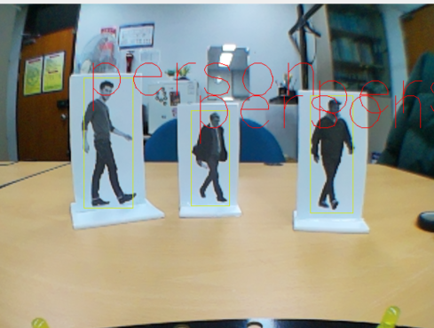
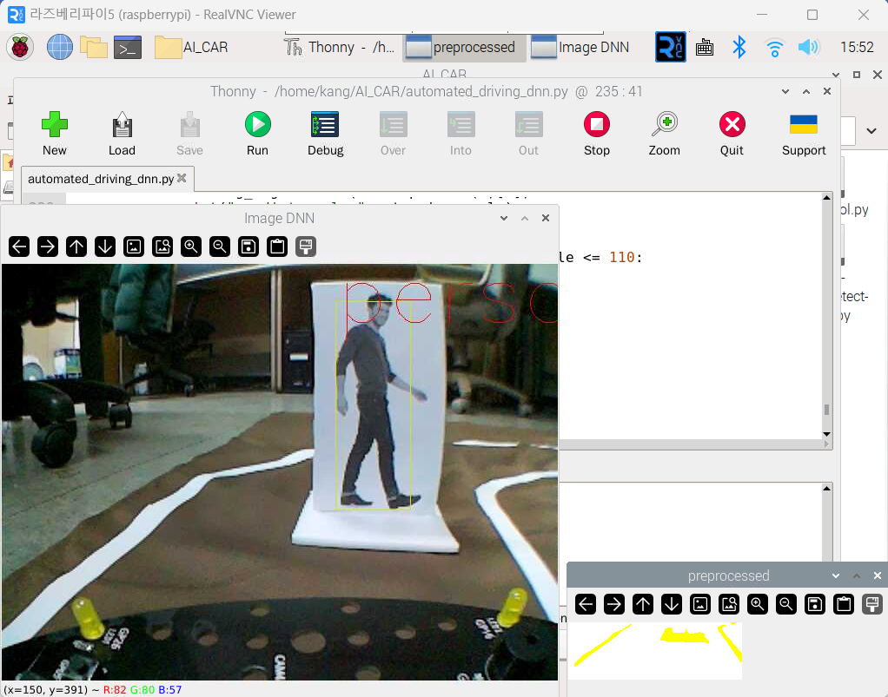
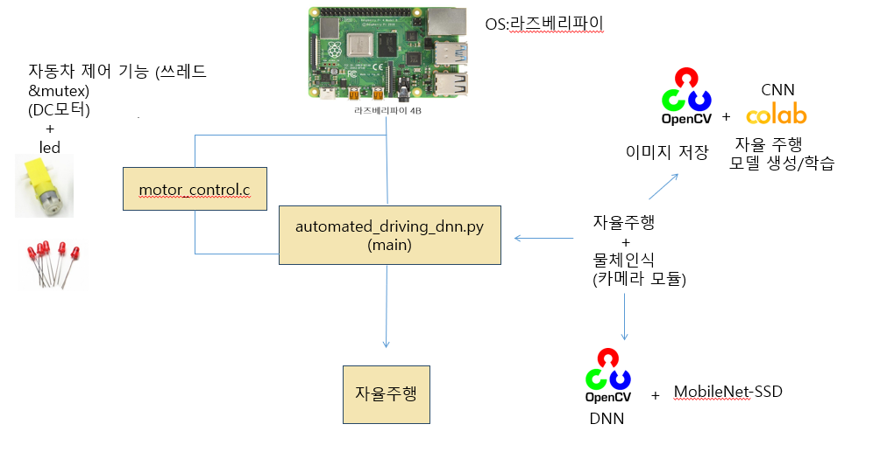

# AI_CAR
9조 임베디드 프로젝트  
라즈베리파이를 활용한 자율주행 모형 자동차 구현 프로젝트

## 팀 소개
### 임베디드 9조

|   이름               |     학번     | 역할                |
|----------------------| --------------|---------------------|
| **이기원**          | 20170776      | 딥러닝 자율주행 모델 구축 및 학습, 학습 데이터 생성 |
| **강민재**          | 20221315      | 모형 자동차 제작, 원격 제어 기능 구현, 자료 조사, 부품 보급 |
| **이재찬**          | 20200894      | 딥러닝 자율주행 모델 적용 및 테스트,  원격 제어 기능 구현|
| **한성룡**          | 20221387      | 원격제어 기능 구헌, 발표자료 제작, 재료 및 부품 보급 |

    
## DEMO
### 자율주행 기능
- 좌회전
  

  
- 우회전
  

  
### 비상정지 기능 
- 카메라가 사람을 탐지하면 멈추는 기능을 구현함.


### 수동조작 기능

  
### 객체 탐지
- OpenCV DNN + MobileNet v2를 활용해서 객체탐지 기능을 구현함.


    
## 파일구조
파일 구조에 대한 설명

## 실행 파일

  
## 시스템 구조

- `automated_driving_dnn.py`
  - 자율 주행 및 장애물 탑재 기능을 담당하는 소스 코드 파일
  - 차량 제어를 위해 `motor_contorl.c`에 등록된 함수를 호출하여 전역 변수 `carState`의 값을 변경함

- `motor_control.c`
  - DC 모터를 제어하는 함수
  - 멀티쓰레드를 실행하는 방식으로 함수를 호출함.
  - 전역 변수 `carState` 값에 따라 이동 여부 또는 이동 방향을 결정함.

- `automated_driving_dnn.py`에서 `motor_control.c` 호출하기
  - 파이썬의 표준 라이브러리 `ctypes`를 활용
  - `motor_contorl.c`를 컴파일하려 동적 라이브러리인 `libmotor.so`를 생성
  - 파이썬 파일에서 libmotor.so 객체를 생성하여 c 라이브러리를 로드함.
  ###### 컴파일 명령:
  ```bash
  gcc -shared -o libmotor.so -fPIC -motor_control.c -lwiringPi -lpthread
  ```


### 임베디드 파트
- DC 모터
  - 차량의 기본적인 움직임을 제어하는 용도로 사용.
  - 전진, 좌회전, 우회전 이동 가능.
- 카메라 모듈
  -  도로를 식별하고 장애물을 탐지하는 역할 담당. 주변 환경 인식
  
### 인공지능 파트
수동 조작 기능을 통해 학습 데이터를 생성하고 자율 주행 모델을 학습함.
- OpenCV
  - 학습 데이터를 생성하고 인공지능 모델의 성능 개선을 위해 이미지 전처리 작업 진행
  - 카메라로 획득한 이미지를 YUV 형식으로 변환
  - 이미지에 필터를 적용하여 도로의 경계선을 강조한 후 학습 데이터를 생성
  
#### 이미지 전처리 작업
|    전처리 전         |     전처리 후        |
|----------------------|-----------------------|
| ![전처리 전 이미지]  | ![전처리 후 이미지]   |
  
- 자율주행 모델
  - [end to end learning for self-driving cars](https://developer.nvidia.com/blog/deep-learning-self-driving-cars/)에 소개된 CNN 모델 구조를 활용
  - 텐서플로우로 CNN 모델을 구현 후 학습 데이터로 모델을 학습시킴
  - 학습된 CNN 구조의 추론 기능을 활용해서 전진, 좌회전, 우회전인지 판단하는 기능을 구현
- 객체 탐지 모델
  - 효율적인 개발을 위해 사전에 훈련된 모델인 MobileNetV2를 사용함.
  - 경량화된 모델로 하드웨어 성능이 제한된 임베디드 환경에 적합함.
  - MobileNet의 추론 기능을 사용하기 위해 OpenCV DNN를 활용함

## 제한조건 구현 (멀티쓰레드 & Mutex 활용) 
1. 자율주행과 장애물 감지가 동시에 수행되어야 함.
2. 이동 중 장애물 감지 시 정지 동작이 수행되어야 함
  
- 일반적인 방법으로는 동시 처리에 어려움이 발생
- 이를 해결하기 위해 멀티쓰레드 기능을 활용
- 모터는 전역변수 'carState'의 값에 의해 제어되므로 동시성 문제를 해결하기 위해 `mutex`를 활용
  
[c 소스 코드에 대한 설명을 여기에 첨부하기]
  
## 문제점 및 해결방안
### 문제점
1. 자율주행 모델 학습을 위한 도로 환경 구성
    - 빛 반사가 있을 경우 이미지에서 도로를 잘 인식할 수 없음
    - 이로 인해 양질의 학습 데이터 획득이 어려움
2. 물체 탐지 기능과 자율주행기능을 통합
    - 이 과정에서 이미지 처리 지연으로 인해 성능 저하가 발생
4. 모델 훈련 중 과적합 현상이 발생
    - 만족스럽지 않은 자율주행 성능이 나타남
  
### 해결방안
1. 이미지에 추가적인 전처리 작업 수행
   - 픽셀의 밝기 값이 임계치 이상일 때 255로 값을 올리고 임계치 미만일 때는 0으로 값을 내리는 `High-pass filter`(HPF)를 적용.
  
#### HPF 적용 예시
|    적용 전         |     적용 후        |
|--------------------|---------------------|
| ![적용 전 이미지]  | ![적용 후 이미지]   |
  
2. 객체를 탐지하는 시간 간의 간격을 늘려 문제를 해결함
  - 3초에 한번씩 이미지를 분석하여 객체를 탐지함
  
3. 다음 내용을 통해 과적합 현상을 해결함
- `batch size` 감소 : 100 -> 32로 감소
- `learning rate` 조정 : 1e-3 -> 1e-4로 감소 
- 드롭아웃 증가 : 0.2 -> 0.3
- 데이터 증강 (이미지 좌우 반전)
